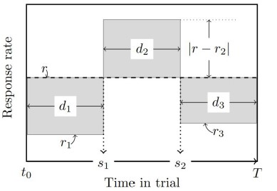

```{r echo = FALSE, warning=FALSE}
library(YEAB)
```

The analysis of single-trials in the peak procedure was introduced by @church1994
to test some predictions of the Scalar Expectancy Theory (SET) about the variability of decision thresholds in interval timing. This analysis exhaustively searches for start and stop times such that the sum of three areas is maximized, as shown below:



Selecting the optimal start and stop times in the peak procedure requires the maximization of three areas (gray rectangles). Those areas are defined by the difference of the overall response rate r and the response rate and the rate at the i state (low r1, low r3 or high r2), multiplied by the duration of the state.*

While @church1994 suggest an exhaustive search (that is, a grid search for s1 and s2, using every combination of start and stop times as a grid subject to $s_1$ < $s_2$), our implementation first defines an objective function:

$$𝑓(s_1,s_2) = \sum_{i=1}^{3} d_i|r-r_i|, \text{ for } i \in 1,2,3$$

where $d_1$ = $s_1$, $d_2 = (s_2 - s_1)$, and $d_3 = (T - s_2)$, $T$ is the trial duration, $r$ is the overall response rate, and $r1,r2,r3$ the response rates corresponding to $d_i$. The optimization problem thus becomes:

$$s_1^*, s_2^* = \argmax_{0 \leq s_1 \leq s_2 \leq T} f(s_1, s_2)$$

We obtain the optimal start and stop times using standard optimization procedures, specifically the `optim()` built-in R function, returning a data frame with the following columns:

- `start` the start time of the peak.
- `stop` the stop time of the peak.
- `spread` the spread of the peak (stop - start). 
- `middle` the middle of the peak (mean of start and stop)

The `ind_trial_opt()` function takes the following parameters:

- `response_times` a numerical vector of raw response times.
- `trial_duration` numeric value for the duration of the trial.
- `optim_method` the optimization method to be used (see [`optim()`](https://www.rdocumentation.org/packages/stats/versions/3.6.2/topics/optim) for details, the default is "Nelder-Mead").

Using the same open dataset in @buritica2019, we benchmarked the optimized implementation and found that it is between **7x** to **60x** faster (depending on the number of datapoints) than the exhaustive search.

However, we also provide the exhaustive search method with the `exhaustive_lhl()` function. This function takes the same parameters as `ind_trial_opt()` except `optim_method`. The output is the same as the former, with the addition of the response rate at each section of the trail (*r1,r2,r3*).

## Example

First let's load a data sample of response times:

```{r}
data("r_times")

head(r_times, n = 30)
```

Now lets assign the trial duration value from the data set and call the function with those parameters:

```{r}
trial_duration <- max(r_times) |> ceiling() # To take the immediate superior integer.

optim_times <- ind_trials_opt(r_times, trial_duration) # Note we used the default optimization method.

optim_times
```
Alternatively we can also use the exhaustive method like this:
```{r}
exhaus_times <- exhaustive_lhl(r_times, trial_duration)

exhaus_times
```
*Note: both methods get the same results, however, if working with big data sets we recommend using the optimized method.*

Finally lets plot the results:

```{r echo=FALSE}
plot(
  density(
    r_times,
    adjust = 0.8,
    from = 0,
    to = trial_duration
  ),
  main = "Density plot of response times",
  xlab = "Response time (ms)",
  ylab = expression(italic(p(t[R]))),
)
abline(v = 60, lty = 2)
abline(v = optim_times$start, col = "red")
abline(v = optim_times$stop, col = "red")
abline(v = optim_times$middle, col = "red")
```

## References
